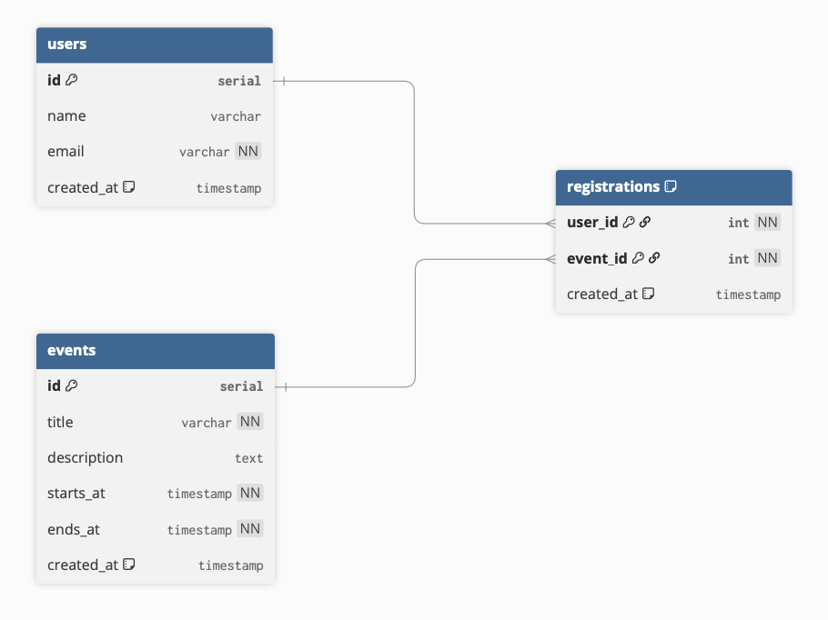

# Entity Relationship Diagram

Reference the Creating an Entity Relationship Diagram final project guide in the course portal for more information about how to complete this deliverable.

## Create the List of Tables

Users
- id (serial, primary key)
- name (varchar)
- email (varchar, unique, not null)
- created_at (timestamp, default now)

Events
- id (serial, primary key)
- title (varchar, not null)
- description (text)
- starts_at (timestamp, not null)
- ends_at (timestamp, not null)
- created_at (timestamp, default now)

Registrations (join table)
- user_id (int, not null) → users.id
- event_id (int, not null) → events.id
- created_at (timestamp, default now)
- Primary Key: (user_id, event_id) to prevent duplicate sign‑ups

## Add the Entity Relationship Diagram

[👉🏾👉🏾👉🏾 Include an image or images of the diagram below. You may also wish to use the following markdown syntax to outline each table, as per your preference.]

| Column Name | Type | Description |
|-------------|------|-------------|
| id | integer | primary key |
| name | text | name of the shoe model |
| ... | ... | ... |

