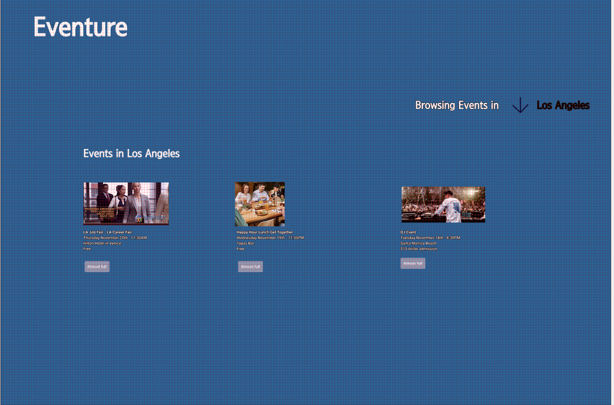

# Wireframes

Reference the Creating an Entity Relationship Diagram final project guide in the course portal for more information about how to complete this deliverable.

## List of Pages

## Wireframe 1: [Home Page]

## Wireframe 2: [Event Overview]

## Wireframe 3: [Event Sign up]

[👉🏾👉🏾👉🏾 include wireframe 3]

[👉🏾👉🏾👉🏾 include more wireframes as desired]
